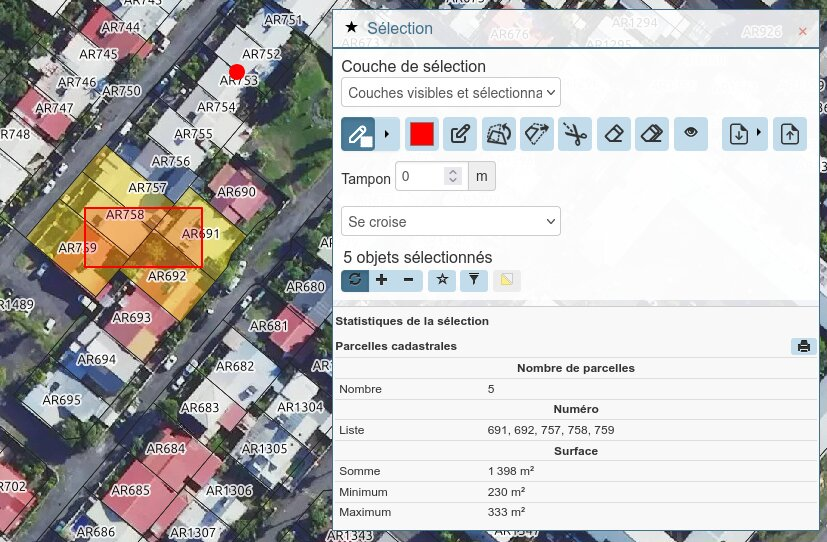

# Statistiques sur la sélection

**Français** · [English](#selection-statistics)

Affiche des statistiques agrégées sur les entités sélectionnées, au bas du
panneau de sélection de Lizmap.

Cible : **Lizmap Web Client 3.9**. Réécriture en JavaScript natif du script
communautaire d'origine, prévu pour LWC 3.6.



## Exemple complet

La capture ci-dessus correspond exactement à cette configuration, sur cinq
parcelles sélectionnées :

```javascript
const STATISTICS_CONFIG = {
    layers: {
        'Parcelles': {
            label: 'Parcelles cadastrales',
            fields: {
                'id_source': {
                    aggregates: ['count'],
                    label: 'Nombre de parcelles'
                },
                'numero': {
                    aggregates: ['list'],
                    label: 'Numéro'
                },
                'contenance': {
                    aggregates: ['sum', 'minimum', 'maximum'],
                    label: 'Surface',
                    format: { type: 'area', unit: 'm2' }
                }
            }
        }
    }
};
```

| Champ | Agrégat | Résultat |
|---|---|---|
| Nombre de parcelles | Nombre | `5` |
| Numéro | Liste | `691, 692, 757, 758, 759` |
| Surface | Somme | `1 398 m²` |
| Surface | Minimum | `230 m²` |
| Surface | Maximum | `333 m²` |

Trois choses à y lire. Le comptage porte sur `id_source`, la clé primaire, parce
que `count` compte les valeurs **renseignées** d'un champ, pas les entités
sélectionnées. Les numéros sortent triés naturellement, sans qu'on ait rien
demandé, `sort: 'natural'` étant le défaut. Et l'icône d'impression, à droite du
titre du bloc, n'apparaît que si une mise en page a été configurée.

## Installation

Copier `show_statistics_on_selection_3.9.js` et `show_statistics_on_selection.css`
dans le dossier `media/js/<projet>/` de votre projet, comme décrit dans la
[documentation Lizmap](https://docs.lizmap.com/current/fr/publish/customization/javascript.html).

Le module ne s'initialise qu'à l'ouverture du panneau de sélection, ce qui évite
d'alourdir le chargement des cartes où il ne sert pas.

**La couche doit être publiée en WFS.** Sans elle dans les capacités du service,
le module ne peut pas récupérer les entités.

## Réglages généraux

En tête du fichier JS, au-dessus de la ligne « DO NOT MODIFY BELOW THIS LINE » :

| Constante | Rôle |
|---|---|
| `DEBUG_MODE` | Traces de diagnostic en console, préfixées `[stats]`. Mettre à `false` en production. |
| `LOCALE` | `'auto'` suit la langue de l'interface Lizmap, puis celle du navigateur. Une étiquette BCP 47 (`'fr-FR'`, `'en-GB'`) force la langue. |
| `FALLBACK_LOCALE` | Langue de repli quand la langue active n'est pas traduite. |
| `CURRENCY` | Code ISO 4217 pour `format.type: 'currency'`. Surchargeable par champ. |
| `PANEL_TITLE` | Titre du bloc. `null` utilise le titre traduit. |
| `MAX_FEATURES` | Au-delà, le module affiche un message au lieu de calculer. |
| `FETCH_QGIS_ALIASES` | Récupérer les alias de champs du projet QGIS. Coûte une requête par couche, au démarrage uniquement. Inutile si tous vos champs ont un `label` dans la configuration. |

## Configuration des couches

```javascript
const STATISTICS_CONFIG = {
    layers: {
        'Parcelles': {                          // nom exact de la couche dans QGIS
            label: 'Parcelles cadastrales',     // optionnel, défaut : nom de la couche
            fields: {
                'contenance': {
                    aggregates: ['sum', 'maximum'],
                    label: 'Surface',
                    format: { type: 'area', unit: 'ha', decimals: 2 }
                },
                'nb_bati': ['sum']              // forme courte
            }
        }
    }
};
```

Une couche absente du projet, un agrégat inconnu ou un `format.type` invalide
produisent un avertissement `[stats]` au démarrage, et l'entrée concernée est
ignorée sans bloquer le reste.

Le libellé d'un champ est résolu dans cet ordre : `label` de la configuration,
puis alias QGIS si `FETCH_QGIS_ALIASES` est actif et l'alias non vide, puis nom
du champ.

Les agrégats s'affichent dans l'ordre où vous les écrivez.

## Agrégats

### Numériques

`count`, `sum`, `average`, `minimum`, `maximum`.

Les valeurs non renseignées sont écartées avant calcul, et les valeurs non
convertibles en nombre sont ignorées. Si rien d'exploitable ne subsiste,
l'affichage montre un tiret et un avertissement est émis une fois en console.

**Attention à `count`** : il compte les entités dont **ce champ** a une valeur
renseignée. Pour compter les entités sélectionnées, appliquez-le à un champ
jamais nul, typiquement la clé primaire.

### Texte

Applicables à n'importe quel type de champ.

#### `list` — énumération des valeurs

```javascript
'numero': {
    aggregates: ['list'],
    label: 'Numéro',
    list: { separator: ', ', maxItems: 50, sort: 'natural', distinct: true }
}
```

```
Numéro    213, 243, 244, 276
```

| Option | Défaut | Rôle |
|---|---|---|
| `separator` | `', '` | Séparateur entre valeurs. |
| `maxItems` | `50` | Au-delà : `… et N autres`. |
| `sort` | `'natural'` | `'natural'` trie `2, 10, 100` ; `'alpha'` trie `10, 100, 2` ; `'none'` garde l'ordre de la sélection. |
| `distinct` | `true` | Dédoublonner la liste. |

Le tri naturel est le défaut parce que les numéros cadastraux arrivent sous forme
de chaînes : un tri alphabétique donnerait `10, 100, 2, 244`.

`list.distinct` est un booléen de dédoublonnage, à ne pas confondre avec
l'agrégat `distinct`, qui renvoie un compte. Les deux peuvent coexister sur un
même champ.

#### `frequency` — répartition

```javascript
'degre_risk_inon': {
    aggregates: ['frequency'],
    label: 'Aléa inondation',
    frequency: { maxItems: 10 }
}
```

```
Aléa inondation
  Moyen               11
  Faible               9
  Fort                 4
  (non renseigné)      6
```

Chaque valeur distincte avec son nombre d'occurrences, triée par occurrences
décroissantes. Seul agrégat produisant plusieurs lignes.

Les valeurs non renseignées sont **conservées** — leur nombre est une
information — et toujours placées en dernier, hors du classement. Elles ne sont
jamais emportées par la troncature `maxItems`.

#### `distinct` — nombre de valeurs différentes

```
Section    Valeurs distinctes    7
```

Valeurs non renseignées écartées. Se combine bien avec `list` :
`{ aggregates: ['distinct', 'list'] }` donne le compte et l'énumération.

## Formatage

| `format.type` | Options | Rendu en `fr-FR` | Rendu en `en-US` |
|---|---|---|---|
| `number` (défaut) | `decimals` | `12 345,6` | `12,345.6` |
| `area`, `unit: 'm2'` | — | `124 310 m²` | `124,310 m²` |
| `area`, `unit: 'ha'` | `decimals` | `12,43 ha` | `12.43 ha` |
| `currency` | `decimals`, `currency` | `185 000 €` | `€185,000` |

`unit: 'auto'` bascule en hectares au-delà de 10 000 m². Si `decimals` est omis,
0 à 2 décimales sont affichées selon la valeur.

En `unit: 'm2'`, la valeur est toujours rendue entière : `decimals` y est ignoré,
une surface en mètres carrés étant un entier.

Le placement du symbole monétaire suit la langue active : suffixé en français,
préfixé en anglais. `format.currency` permet de surcharger `CURRENCY` sur un
champ donné.

Le format s'applique au couple champ + agrégat : `count`, `distinct` et
`frequency` produisent des effectifs, toujours rendus en entiers nus, même si le
champ déclare un format.

## Traductions

`LOCALE` choisit la langue, `TRANSLATIONS` contient les textes. Pour ajouter une
langue, copiez un bloc et traduisez les valeurs :

```javascript
const TRANSLATIONS = {
    fr: { panelTitle: 'Statistiques de la sélection', count: 'Nombre', /* ... */ },
    en: { panelTitle: 'Selection statistics', count: 'Count', /* ... */ },
    es: { count: 'Recuento' }   // bloc partiel : le reste retombe sur FALLBACK_LOCALE
};
```

La résolution cherche l'étiquette exacte (`pt-BR`), puis la sous-étiquette
primaire (`pt`), puis `FALLBACK_LOCALE`. Les clés manquantes retombent
**individuellement** sur la langue de repli, donc une traduction partielle
fonctionne.

`LOCALE` alimente aussi le tri et le formatage des nombres, l'ordre alphabétique
dépendant de la langue.

Les `label` de `STATISTICS_CONFIG` ne sont pas traduits : ce sont des données de
votre projet, pas des chaînes du module.

## Impression de la sélection

Désactivée par défaut. Une fois activée, chaque bloc de couche affiche un bouton
d'impression qui génère un PDF contenant la carte, la sélection surlignée, un
titre et les statistiques du bloc.

### Préparer la mise en page dans QGIS

Créez une mise en page dédiée contenant :

| Élément | Contrainte |
|---|---|
| Une carte | Son identifiant est libre : le script le lit dans le projet. |
| Une étiquette pour le titre | Identifiant sans accent ni espace : il devient un nom de paramètre HTTP. |
| Une étiquette pour les statistiques | Même règle, et **cochez « rendu HTML »** dessus. |

Le rendu HTML est le seul point qui change vraiment le résultat : avec, les
statistiques sont un tableau à deux colonnes ; sans, un texte aligné à l'espace
qui se décale dès qu'une valeur est plus longue que les autres. Le module gère
les deux et détecte automatiquement lequel s'applique.

Si la mise en page contient plusieurs cartes, la première est utilisée et un
avertissement le signale.

**Republiez le projet depuis le plugin Lizmap** après toute modification de mise
en page. Le fichier `.cfg` est la seule source que Lizmap lit ; enregistrer le
`.qgs` ne suffit pas.

### Activer

```javascript
const PRINT_LAYOUT = 'Impression sélection';   // nom exact dans QGIS, null pour désactiver
const PRINT_TITLE_LABEL_ID = 'stats_title';
const PRINT_CONTENT_LABEL_ID = 'stats_content';
const PRINT_DPI = 100;
```

Un titre par couche, facultatif :

```javascript
'Parcelles': {
    label: 'Parcelles cadastrales',                             // titre du bloc à l'écran
    printTitle: 'Extrait cadastral - parcelles sélectionnées',  // titre imprimé
    fields: { ... }
}
```

`printTitle` est utile quand un intitulé court convient au panneau et une
formulation complète à un A3. Omis, le `label` est utilisé.

La mise en page dédiée est automatiquement masquée de la liste d'impression de
Lizmap, où elle ne servirait à rien : elle attend des valeurs d'étiquettes que
seul ce module fournit.

### Ce qui est imprimé

**La carte garde l'échelle de l'écran** : une parcelle sort à la taille où vous
la voyez. C'est le comportement du panneau d'impression de Lizmap.

Le cadre de la mise en page étant physiquement plus petit que l'écran, il montre
donc **moins de terrain** que la vue, centré au même endroit — et non la totalité
de ce qui est affiché.

Les couches imprimées sont celles visibles à l'écran, fond de carte compris. Si
cette information n'est pas accessible, le module se rabat silencieusement sur
les couches enregistrées dans la mise en page, et l'impression fonctionne quand
même.

Le PDF est téléchargé sous un nom dérivé du titre et de la date, par exemple
`extrait-cadastral-parcelles-selectionnees-2026-08-04.pdf`.

### Diagnostic

Une mise en page introuvable, un identifiant d'étiquette inexistant ou une mise
en page sans carte produisent un avertissement `[stats]` au démarrage **listant
les valeurs disponibles**, et le bouton n'apparaît pas. Le reste du module
continue de fonctionner.

## Diagnostic

`window.lizStats` expose les classes du module pour inspection en console :

```javascript
window.lizStats.Aggregator.compute('L', 'f', 'sum', [100, null, '200']);
// { kind: 'numeric', value: 300 }

window.lizStats.instance();   // l'instance courante, ou null
```

Avec `DEBUG_MODE = true`, les traces `[stats]` indiquent la requête WFS émise, le
nombre d'entités reçues et les couches configurées au démarrage.

## Fonctionnement

À chaque changement de sélection, le module émet **une seule** requête WFS,
filtrée par `FEATUREID` sur les identifiants fournis par l'événement Lizmap, et
limitée aux champs configurés par `PROPERTYNAME`. Les alias de champs sont
chargés une fois au démarrage, pas à chaque sélection.

Une sélection sur une couche absente de `STATISTICS_CONFIG` est ignorée sans
aucun traitement.

## Limites connues

- Sur deux sélections très rapprochées, l'affichage peut brièvement montrer les
  chiffres de la première ; il se corrige à la sélection suivante.
- Les alias QGIS sont mis en cache au démarrage. Une republication du projet
  pendant qu'une carte est ouverte n'est prise en compte qu'au rechargement de
  la page.
- Au-delà de `MAX_FEATURES` entités sélectionnées, le module affiche un message
  plutôt que de calculer.
- L'impression envoie les couches visibles, mais pas leurs styles ni leurs
  opacités : un style secondaire ou une transparence de l'écran ne sont pas
  reproduits sur le PDF.
- `AbortSignal.timeout()` demande Firefox 100+ ou Chrome 103+.

## Licence

Mozilla Public License Version 2.0

---
---

# Selection statistics

[Français](#statistiques-sur-la-sélection) · **English**

Displays aggregated statistics about the selected features, at the bottom of
Lizmap's selection panel.

Targets **Lizmap Web Client 3.9**. Vanilla JavaScript rewrite of the original
community script, written for LWC 3.6.


## Worked example

The screenshot above is exactly what this configuration produces, on five
selected parcels:

```javascript
const STATISTICS_CONFIG = {
    layers: {
        'Parcelles': {
            label: 'Parcelles cadastrales',
            fields: {
                'id_source': {
                    aggregates: ['count'],
                    label: 'Nombre de parcelles'
                },
                'numero': {
                    aggregates: ['list'],
                    label: 'Numéro'
                },
                'contenance': {
                    aggregates: ['sum', 'minimum', 'maximum'],
                    label: 'Surface',
                    format: { type: 'area', unit: 'm2' }
                }
            }
        }
    }
};
```

| Field | Aggregate | Result |
|---|---|---|
| Nombre de parcelles | Count | `5` |
| Numéro | List | `691, 692, 757, 758, 759` |
| Surface | Sum | `1 398 m²` |
| Surface | Minimum | `230 m²` |
| Surface | Maximum | `333 m²` |

Three things worth noticing. The count is applied to `id_source`, the primary
key, because `count` counts the **filled-in** values of a field, not the
selected features. The numbers come out naturally sorted without asking, since
`sort: 'natural'` is the default. And the print icon, to the right of the block
title, only appears once a print layout has been configured.

## Installation

Copy `show_statistics_on_selection_3.9.js` and `show_statistics_on_selection.css`
into your project's `media/js/<project>/` folder, as described in the
[Lizmap documentation](https://docs.lizmap.com/current/en/publish/customization/javascript.html).

The module only initialises when the selection panel is opened, so it costs
nothing on maps where it is not used.

**The layer must be published through WFS.** Without it in the service
capabilities, the module cannot fetch the features.

## General settings

At the top of the JS file, above the "DO NOT MODIFY BELOW THIS LINE" marker:

| Constant | Purpose |
|---|---|
| `DEBUG_MODE` | Console diagnostics, prefixed `[stats]`. Set to `false` in production. |
| `LOCALE` | `'auto'` follows the Lizmap interface language, then the browser. Any BCP 47 tag (`'fr-FR'`, `'en-GB'`) forces one. |
| `FALLBACK_LOCALE` | Language used when the active one has no translation. |
| `CURRENCY` | ISO 4217 code for `format.type: 'currency'`. Overridable per field. |
| `PANEL_TITLE` | Block title. `null` uses the translated one. |
| `MAX_FEATURES` | Above this count, the module shows a message instead of computing. |
| `FETCH_QGIS_ALIASES` | Fetch the field aliases from the QGIS project. One request per layer, at startup only. Pointless if every field carries a `label` in the config. |

## Layer configuration

```javascript
const STATISTICS_CONFIG = {
    layers: {
        'Parcelles': {                          // exact layer name as in QGIS
            label: 'Parcelles cadastrales',     // optional, default: layer name
            fields: {
                'contenance': {
                    aggregates: ['sum', 'maximum'],
                    label: 'Surface',
                    format: { type: 'area', unit: 'ha', decimals: 2 }
                },
                'nb_bati': ['sum']              // short form
            }
        }
    }
};
```

A layer missing from the project, an unknown aggregate or an invalid
`format.type` produces a `[stats]` warning at startup, and that entry alone is
skipped.

A field label is resolved in this order: the config `label`, then the QGIS alias
if `FETCH_QGIS_ALIASES` is on and the alias is not empty, then the field name.

Aggregates are displayed in the order you write them.

## Aggregates

### Numeric

`count`, `sum`, `average`, `minimum`, `maximum`.

Unfilled values are discarded before computing, and values that cannot be
converted to a number are ignored. If nothing usable remains, the cell shows a
dash and a warning is emitted once in the console.

**Mind `count`**: it counts the features where **that field** is filled in. To
count the selected features, apply it to a never-null field, typically the
primary key.

### Text

Applicable to any field type.

#### `list` — enumerate the values

```javascript
'numero': {
    aggregates: ['list'],
    label: 'Numéro',
    list: { separator: ', ', maxItems: 50, sort: 'natural', distinct: true }
}
```

```
Numéro    213, 243, 244, 276
```

| Option | Default | Purpose |
|---|---|---|
| `separator` | `', '` | Between values. |
| `maxItems` | `50` | Beyond it: `… and N more`. |
| `sort` | `'natural'` | `'natural'` sorts `2, 10, 100`; `'alpha'` sorts `10, 100, 2`; `'none'` keeps the selection order. |
| `distinct` | `true` | Deduplicate the list. |

Natural sort is the default because cadastral numbers arrive as strings: an
alphabetical sort would give `10, 100, 2, 244`.

`list.distinct` is a deduplication flag, not to be confused with the `distinct`
aggregate, which returns a count. Both may sit on the same field.

#### `frequency` — distribution

```javascript
'degre_risk_inon': {
    aggregates: ['frequency'],
    label: 'Aléa inondation',
    frequency: { maxItems: 10 }
}
```

```
Aléa inondation
  Moyen               11
  Faible               9
  Fort                 4
  (not set)            6
```

Each distinct value with its number of occurrences, sorted by descending count.
The only aggregate producing several rows.

Unfilled values are **kept** — their number is information — and always listed
last, outside the ranking. They are never dropped by the `maxItems` truncation.

#### `distinct` — how many different values

```
Section    Distinct values    7
```

Unfilled values discarded. Combines well with `list`:
`{ aggregates: ['distinct', 'list'] }` gives both the count and the enumeration.

## Formatting

| `format.type` | Options | Rendered in `fr-FR` | Rendered in `en-US` |
|---|---|---|---|
| `number` (default) | `decimals` | `12 345,6` | `12,345.6` |
| `area`, `unit: 'm2'` | — | `124 310 m²` | `124,310 m²` |
| `area`, `unit: 'ha'` | `decimals` | `12,43 ha` | `12.43 ha` |
| `currency` | `decimals`, `currency` | `185 000 €` | `€185,000` |

`unit: 'auto'` switches to hectares above 10 000 m². When `decimals` is omitted,
0 to 2 fraction digits are shown depending on the value.

With `unit: 'm2'` the value is always rendered whole: `decimals` is ignored
there, since an area in square metres is an integer.

The currency symbol is placed according to the active language: suffixed in
French, prefixed in English. `format.currency` overrides `CURRENCY` on a given
field.

The format applies to the field/aggregate pair, not the field alone: `count`,
`distinct` and `frequency` yield head counts and always render as bare integers,
even on a field declaring a format.

## Translations

`LOCALE` picks the language, `TRANSLATIONS` holds the strings. To add a
language, copy a block and translate the values:

```javascript
const TRANSLATIONS = {
    fr: { panelTitle: 'Statistiques de la sélection', count: 'Nombre', /* ... */ },
    en: { panelTitle: 'Selection statistics', count: 'Count', /* ... */ },
    es: { count: 'Recuento' }   // partial block: the rest falls back to FALLBACK_LOCALE
};
```

Lookup tries the exact tag (`pt-BR`), then the primary subtag (`pt`), then
`FALLBACK_LOCALE`. Missing keys fall back **individually**, so a partial
translation works.

`LOCALE` also drives sorting and number formatting, alphabetical order being
language-dependent.

The `label` values in `STATISTICS_CONFIG` are not translated: they are your
project's data, not the module's strings.

## Printing the selection

Disabled by default. Once enabled, each layer block shows a print button that
generates a PDF containing the map, the highlighted selection, a title and the
block's statistics.

### Preparing the QGIS layout

Create a dedicated layout containing:

| Item | Constraint |
|---|---|
| One map | Its id is free: the script reads it from the project. |
| A label for the title | Id without accents or spaces: it becomes an HTTP parameter name. |
| A label for the statistics | Same rule, and **tick "render as HTML"** on it. |

The HTML rendering is the one setting that really changes the result: with it,
the statistics are a two-column table; without it, space-aligned text that drifts
as soon as one value is longer than the others. The module handles both and
detects which applies.

If the layout holds several maps, the first one is used and a warning says so.

**Republish the project from the Lizmap plugin** after any layout change. The
`.cfg` file is the only source Lizmap reads; saving the `.qgs` is not enough.

### Enabling

```javascript
const PRINT_LAYOUT = 'Impression sélection';   // exact name in QGIS, null to disable
const PRINT_TITLE_LABEL_ID = 'stats_title';
const PRINT_CONTENT_LABEL_ID = 'stats_content';
const PRINT_DPI = 100;
```

An optional per-layer title:

```javascript
'Parcelles': {
    label: 'Parcelles cadastrales',                             // block title on screen
    printTitle: 'Extrait cadastral - parcelles sélectionnées',  // printed title
    fields: { ... }
}
```

`printTitle` helps when a short wording suits the panel and a full one suits an
A3 sheet. Omitted, the `label` is used.

The dedicated layout is automatically hidden from Lizmap's own print list, where
it would be useless: it expects label values only this module supplies.

### What gets printed

**The map keeps the screen scale**: a parcel comes out the size you see it. This
is what Lizmap's own print panel does.

Since the layout frame is physically smaller than the screen, it therefore shows
**less ground** than the view, centred on the same spot — not the whole of what
is displayed.

The printed layers are the ones visible on screen, base map included. If that
information is not reachable, the module silently falls back to the layers saved
in the layout, and printing still works.

The PDF is downloaded under a name derived from the title and the date, for
instance `extrait-cadastral-parcelles-selectionnees-2026-08-04.pdf`.

### Troubleshooting

A missing layout, an unknown label id or a layout without a map produce a
`[stats]` warning at startup **listing what is available**, and the button does
not appear. The rest of the module keeps working.

## Diagnostics

`window.lizStats` exposes the module classes for console inspection:

```javascript
window.lizStats.Aggregator.compute('L', 'f', 'sum', [100, null, '200']);
// { kind: 'numeric', value: 300 }

window.lizStats.instance();   // the current instance, or null
```

With `DEBUG_MODE = true`, the `[stats]` traces report the WFS request sent, how
many features came back, and the layers configured at startup.

## How it works

On every selection change the module issues **one** WFS request, filtered by
`FEATUREID` on the identifiers carried by the Lizmap event, and narrowed to the
configured fields by `PROPERTYNAME`. Field aliases are loaded once at startup,
not on every selection.

A selection on a layer absent from `STATISTICS_CONFIG` is ignored entirely.

## Known limitations

- On two selections in quick succession, the panel may briefly show the figures
  of the first one; it corrects itself on the next selection.
- QGIS aliases are cached at startup. Republishing the project while a map is
  open is only picked up after a page reload.
- Above `MAX_FEATURES` selected features, the module shows a message instead of
  computing.
- Printing sends the visible layers, but neither their styles nor their
  opacities: a secondary style or an on-screen transparency is not reproduced on
  the PDF.
- `AbortSignal.timeout()` requires Firefox 100+ or Chrome 103+.

## License

Mozilla Public License Version 2.0
